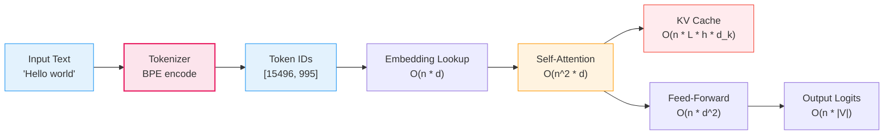

# Byte Pair Encoding (BPE) Tokenization -- Deep Dive

## The Intuition

### What Problem Are We Solving?

Every language model operates on sequences of integers, not strings. Before a model can process "The cat sat on the mat," we need a function that maps text to a list of integer IDs and another that maps IDs back to text. This mapping is called tokenization, and the choice of tokenizer fundamentally shapes every aspect of model behavior and performance.

There are two extreme approaches, and both fail:

**Character-level tokenization** maps each character (or byte) to an ID. The vocabulary is tiny (256 for bytes), but sequences become extremely long. The sentence "The cat sat on the mat." becomes 24 tokens. Since attention is $O(n^2)$ in sequence length, long sequences are computationally expensive. Worse, the model must learn to compose characters into words -- it sees `T`, `h`, `e` as three separate tokens and must discover that this sequence means "the."

**Word-level tokenization** maps each word to an ID. Sequences are short ("The cat sat on the mat." becomes 7 tokens), but the vocabulary must contain every word the model will ever encounter. English alone has hundreds of thousands of words, plus proper nouns, technical jargon, misspellings, and code. Any word not in the vocabulary becomes `<unk>` (unknown), and the model has zero information about it. Worse, "running" and "runner" get completely separate representations despite sharing a root.

The problem: we need a tokenization strategy that keeps sequences short enough for efficient attention, keeps the vocabulary small enough to train well, handles any possible input text, and captures morphological structure (word parts that carry meaning).

### The Key Insight

What if we let the data decide the vocabulary? Start with individual bytes (guaranteed to cover every possible input), then repeatedly merge the most common adjacent pair of tokens into a new single token. After enough merges, common words like "the" become single tokens, common suffixes like "ing" become single tokens, and rare words decompose into recognizable subword pieces. The word "tokenization" might split into `["token", "ization"]` -- both pieces the model has seen frequently in other contexts.

This is Byte Pair Encoding: a simple greedy compression algorithm repurposed as a vocabulary construction method. The "byte" part means we start from byte-level tokens (256 base tokens), guaranteeing that any UTF-8 text can be represented. The "pair encoding" part means we iteratively merge the most frequent adjacent pair.

### Real-World Analogy

Imagine you are a stenographer developing shorthand for a courtroom. You start by writing every letter individually. After a week, you notice that "th" appears constantly, so you invent a single symbol for it. Then "the" appears so often that you combine your "th" symbol with "e" into one mark. Then "the " (with trailing space) gets its own symbol. After months, you have hundreds of shorthand symbols: common words are single strokes, common prefixes and suffixes are single strokes, and you can still spell out any rare word letter by letter. You never encounter a word you cannot write -- it just takes more strokes for unusual words. This is exactly what BPE does: learn shorthand symbols from data, with a fallback to individual characters for anything rare.

---

## The Math, Step by Step

### Building Up: From Bytes to Subwords

**Step 1: The Base Vocabulary**

We start with 256 tokens, one for each possible byte value (0x00 through 0xFF). Every UTF-8 string is a sequence of bytes, so this base vocabulary can represent any text:

$$V_0 = \{b_0, b_1, \ldots, b_{255}\}$$

where $b_i$ is the single-byte token with value $i$.

**Step 2: Counting Pairs**

Given a corpus split into words (via pre-tokenization), we represent each word as a sequence of byte tokens and count how often each adjacent pair appears:

$$\text{count}(a, b) = \sum_{w \in \text{corpus}} \text{freq}(w) \cdot \text{occurrences of } (a, b) \text{ in } w$$

where $\text{freq}(w)$ is how many times word $w$ appears in the corpus.

**Step 3: Greedy Merge**

Select the pair with the highest count:

$$(a^*, b^*) = \arg\max_{(a,b)} \text{count}(a, b)$$

Create a new token $a^* \| b^*$ (the concatenation of the two byte strings), add it to the vocabulary, and replace all occurrences of the pair in the corpus with the new token.

**Step 4: Repeat**

Continue until the vocabulary reaches the target size $|V|$:

$$|V| = 256 + |\text{special tokens}| + |\text{merges}|$$

Each merge adds exactly one new token, so the number of merges is $|V| - 256 - |\text{special tokens}|$.

### The Core Equations

**Equation 1 -- Pair frequency:**

$$\text{count}(a, b) = \sum_{w \in \text{corpus}} \text{freq}(w) \cdot |\{i : w_i = a \wedge w_{i+1} = b\}|$$

**Equation 2 -- Best merge selection:**

$$(a^*, b^*) = \arg\max_{(a,b)} \text{count}(a, b)$$

**Equation 3 -- Vocabulary growth:**

$$|V| = 256 + |\text{special tokens}| + |\text{merges}|$$

**Equation 4 -- Compression ratio** (bytes per token, higher is better):

$$\text{CR} = \frac{|\text{text}|_{\text{bytes}}}{|\text{encode}(\text{text})|}$$

**Equation 5 -- Characters per token** (higher is better):

$$\text{CPT} = \frac{|\text{text}|_{\text{chars}}}{|\text{encode}(\text{text})|}$$

### Worked Example: Full Training Walkthrough

**Corpus:** `["ab ab ab ab", "abc abc"]`

Suppose after pre-tokenization we get words with frequencies:

| Word | Frequency |
|------|-----------|
| `"ab"` | 4 |
| `" ab"` | 3 |
| `" abc"` | 1 |
| `"abc"` | 1 |

Each word is split into byte tokens:

| Word | Byte Sequence | Frequency |
|------|---------------|-----------|
| `"ab"` | `(b"a", b"b")` | 4 |
| `" ab"` | `(b" ", b"a", b"b")` | 3 |
| `" abc"` | `(b" ", b"a", b"b", b"c")` | 1 |
| `"abc"` | `(b"a", b"b", b"c")` | 1 |

**Initial vocabulary size:** 256 (all single bytes)

---

**Iteration 1 -- Count all adjacent pairs:**

| Pair | Count | Calculation |
|------|-------|-------------|
| `(b"a", b"b")` | $4 + 3 + 1 + 1 = 9$ | Appears in all four words |
| `(b" ", b"a")` | $3 + 1 = 4$ | Appears in `" ab"` and `" abc"` |
| `(b"b", b"c")` | $1 + 1 = 2$ | Appears in `" abc"` and `"abc"` |

**Best pair:** `(b"a", b"b")` with count 9.

**Merge:** Create token `b"ab"`, add to vocabulary (ID 256).

**Replace** all occurrences of `(b"a", b"b")` with `b"ab"`:

| Word | Byte Sequence After Merge | Frequency |
|------|---------------------------|-----------|
| `"ab"` | `(b"ab",)` | 4 |
| `" ab"` | `(b" ", b"ab")` | 3 |
| `" abc"` | `(b" ", b"ab", b"c")` | 1 |
| `"abc"` | `(b"ab", b"c")` | 1 |

**Vocabulary size:** 257

---

**Iteration 2 -- Recount pairs:**

| Pair | Count |
|------|-------|
| `(b" ", b"ab")` | $3 + 1 = 4$ |
| `(b"ab", b"c")` | $1 + 1 = 2$ |

**Best pair:** `(b" ", b"ab")` with count 4.

**Merge:** Create token `b" ab"`, add to vocabulary (ID 257).

**After merge:**

| Word | Byte Sequence | Frequency |
|------|---------------|-----------|
| `"ab"` | `(b"ab",)` | 4 |
| `" ab"` | `(b" ab",)` | 3 |
| `" abc"` | `(b" ab", b"c")` | 1 |
| `"abc"` | `(b"ab", b"c")` | 1 |

**Vocabulary size:** 258

---

**Iteration 3 -- Recount pairs:**

| Pair | Count |
|------|-------|
| `(b"ab", b"c")` | $1 + 1 = 2$ |
| `(b" ab", b"c")` | $1$ |

**Best pair:** `(b"ab", b"c")` with count 2.

**Merge:** Create token `b"abc"` (ID 258).

And so on until we reach the target vocabulary size.

**Key observation:** The merge order is `[("a","b"), (" ","ab"), ("ab","c"), ...]`. This order is permanent -- it defines the tokenizer's behavior during encoding.

---

## Encoding Walkthrough

### How a Word Gets Tokenized Using Learned Merges

Given the merge rules from training, encoding applies merges in **priority order** (earlier merges = higher priority). This is critical: the same set of merges applied in a different order can produce different tokenizations.

**Example:** Encode the word `"abc"` with merges `[(b"a", b"b"), (b" ", b"ab"), (b"ab", b"c")]`

```
Start:         [b"a", b"b", b"c"]          (individual bytes)

Check merge 0: (b"a", b"b") -- priority 0
  Found at position 0! Apply merge.
Result:        [b"ab", b"c"]

Check merge 0 again: (b"a", b"b") -- no more occurrences

Check merge 1: (b" ", b"ab") -- priority 1
  Not found (no space token).

Check merge 2: (b"ab", b"c") -- priority 2
  Found at position 0! Apply merge.
Result:        [b"abc"]

No more pairs to check. Final tokens: [b"abc"]
Token IDs: [258]
```

### The Priority-Based Merge Algorithm

The implementation does not naively iterate through all merge rules. Instead, for each iteration it scans the current symbol list to find the pair with the **lowest merge index** (highest priority), applies that single merge, and repeats:

```python
while True:
    best_pair = None
    best_priority = infinity

    for i in range(len(symbols) - 1):
        pair = (symbols[i], symbols[i + 1])
        priority = merge_priority.get(pair)
        if priority is not None and priority < best_priority:
            best_priority = priority
            best_pair = pair

    if best_pair is None:
        break

    # Apply best_pair merge to symbols
    ...
```

**Why priority order matters:** Consider the word `"aab"` with merges `[(b"a", b"b"), (b"a", b"a")]`.

- **Correct (priority order):** Merge 0 is `(b"a", b"b")`. Scan `[b"a", b"a", b"b"]` -- found at position 1. Result: `[b"a", b"ab"]`. Now merge 1 is `(b"a", b"a")` -- not found. Done: `[b"a", b"ab"]`.
- **Wrong (left-to-right greedy):** Merge `(b"a", b"a")` first because it appears earlier in the string. Result: `[b"aa", b"b"]`. Now `(b"a", b"b")` cannot apply. Done: `[b"aa", b"b"]` -- a different tokenization.

The priority-based approach ensures that encoding is deterministic and consistent with how the merges were learned during training.

---

## Byte Fallback: Why There Is No Unknown Token

### The Guarantee

Because the base vocabulary contains all 256 possible byte values, any sequence of bytes can be encoded. Since any valid text is a sequence of UTF-8 bytes, and UTF-8 bytes are all in the range 0x00-0xFF, there is no possible input that produces an "unknown" token.

### How Multi-Byte UTF-8 Characters Get Encoded

UTF-8 encodes characters using 1 to 4 bytes:

| Character Range | Bytes | Example |
|-----------------|-------|---------|
| ASCII (U+0000 to U+007F) | 1 byte | `"A"` = `[0x41]` |
| Latin/Greek/Cyrillic (U+0080 to U+07FF) | 2 bytes | `"e"` = `[0xC3, 0xA9]` |
| CJK/Japanese/Korean (U+0800 to U+FFFF) | 3 bytes | `"你"` = `[0xE4, 0xBD, 0xA0]` |
| Emoji/rare scripts (U+10000 to U+10FFFF) | 4 bytes | `"🚀"` = `[0xF0, 0x9F, 0x9A, 0x80]` |

When a tokenizer trained on English encounters Chinese text, the individual Chinese characters were likely never merged during training. Each character falls back to its 3 raw bytes:

```
"你好" -> encode to UTF-8 -> [0xE4, 0xBD, 0xA0, 0xE5, 0xA5, 0xBD]
       -> 6 byte tokens (no merges apply)
```

This is why non-English text produces 3-5x more tokens than English text of equivalent meaning: the byte fallback works, but it does not compress.

The test suite verifies this roundtrip for characters never seen during training:

```python
def test_unseen_characters_roundtrip(self):
    text = "\u4f60\u597d\u4e16\u754c"  # Chinese: "你好世界"
    self.assertEqual(self.tokenizer.decode(self.tokenizer.encode(text)), text)
```

### How Decoding Reconstructs Multi-Byte Characters

The decoder collects raw bytes from all tokens into a `bytearray`, then decodes the entire byte sequence as UTF-8 at the end. This correctly reconstructs multi-byte characters even when they were split across separate byte tokens:

```python
raw_bytes = bytearray()
for tid in token_ids:
    token = self._id_to_token[tid]
    if isinstance(token, bytes):
        raw_bytes.extend(token)
    ...
# At the end:
result = bytes(raw_bytes).decode("utf-8")
```

The key insight: individual byte tokens like `[0xE4]` are not valid UTF-8 on their own, but when concatenated they form valid multi-byte sequences. The decoder must accumulate bytes before attempting UTF-8 decoding.

---

## From Math to Code

### The Data Structures

The implementation has two main classes:

- **`BPETrainer`**: Learns merge rules from a corpus. Stateless -- just a `train()` method that returns a `BPETokenizer`.
- **`BPETokenizer`**: The trained tokenizer with `encode()`, `decode()`, `save()`, `load()`, and analysis utilities.

**Key state in `BPETokenizer`:**

| Attribute | Type | Purpose |
|-----------|------|---------|
| `_vocab` | `Dict[bytes \| str, int]` | Maps each token (bytes or special string) to its integer ID |
| `_merges` | `List[Tuple[bytes, bytes]]` | Ordered list of merge rules learned during training |
| `_merge_priority` | `Dict[Tuple[bytes, bytes], int]` | Reverse lookup: given a pair, what is its merge priority (index)? |
| `_id_to_token` | `Dict[int, bytes \| str]` | Reverse of `_vocab`: maps ID back to token |
| `_special_pattern` | `re.Pattern \| None` | Compiled regex to detect special tokens in input text |
| `_compiled_pattern` | `re.Pattern` | Pre-tokenization regex (GPT-2 style) |

Tokens are represented as `bytes` objects, not strings. This is a deliberate design decision: bytes are the fundamental unit, and merged tokens are byte concatenations. The token for "the" is `b"the"` (3 bytes), not the Python string `"the"`.

### Training Implementation Walkthrough

```python
def train(self, corpus, vocab_size, pattern=GPT2_SPLIT_PATTERN,
          special_tokens=None, min_frequency=1):
```

**Phase 1: Pre-tokenization and byte splitting**

```python
compiled_pattern = re.compile(pattern)

word_freqs: Dict[Tuple[Token, ...], int] = {}
for text in corpus:
    words = compiled_pattern.findall(text)
    for word in words:
        byte_seq = tuple(bytes([b]) for b in word.encode("utf-8"))
        word_freqs[byte_seq] = word_freqs.get(byte_seq, 0) + 1
```

Each text in the corpus is split into "words" using the GPT-2 pre-tokenization regex, which separates contractions, letter sequences, digit sequences, punctuation, and whitespace into distinct chunks. Each chunk is then converted to a tuple of single-byte tokens. The `word_freqs` dictionary maps each unique byte tuple to its corpus frequency.

**Why pre-tokenize?** Without it, BPE would merge across word boundaries. The pair `("d", " ")` at the end of "and " would merge with the space, creating tokens that span words. Pre-tokenization constrains merges to happen within word boundaries, producing cleaner subword units.

**Phase 2: Initialize vocabulary**

```python
vocab: Dict[Token | str, int] = {}
for i in range(256):
    vocab[bytes([i])] = i

next_id = 256
for st in special_tokens:
    vocab[st] = next_id
    next_id += 1
```

IDs 0-255 are reserved for single bytes. Special tokens get the next available IDs. This guarantees a fixed layout: byte tokens always have their byte value as their ID.

**Phase 3: Iterative merging**

```python
num_merges = vocab_size - base_vocab_size
for _ in range(num_merges):
    pair_counts = _get_pair_counts(word_freqs)
    if not pair_counts:
        break

    best_pair = max(pair_counts, key=lambda p: pair_counts[p])
    if pair_counts[best_pair] < min_frequency:
        break

    merges.append(best_pair)
    merged_token = best_pair[0] + best_pair[1]
    vocab[merged_token] = next_id
    next_id += 1

    word_freqs = _apply_merge(word_freqs, best_pair)
```

Each iteration: count all adjacent pairs across the corpus, find the most frequent one, create a new token from it, and update the corpus representation. Two early-exit conditions: no more pairs to merge (all words are single tokens) or the best pair falls below `min_frequency`.

The `_get_pair_counts` helper iterates over every word and every adjacent position, weighting by word frequency:

```python
def _get_pair_counts(word_freqs):
    counts = {}
    for symbols, freq in word_freqs.items():
        for i in range(len(symbols) - 1):
            pair = (symbols[i], symbols[i + 1])
            counts[pair] = counts.get(pair, 0) + freq
    return counts
```

The `_apply_merge` helper scans each word left to right, replacing adjacent occurrences of the target pair with the merged token:

```python
def _apply_merge(word_freqs, pair):
    new_word_freqs = {}
    merged = pair[0] + pair[1]
    for symbols, freq in word_freqs.items():
        new_symbols = []
        i = 0
        while i < len(symbols):
            if i < len(symbols) - 1 and symbols[i] == pair[0] and symbols[i + 1] == pair[1]:
                new_symbols.append(merged)
                i += 2
            else:
                new_symbols.append(symbols[i])
                i += 1
        new_word_freqs[tuple(new_symbols)] = freq
    return new_word_freqs
```

Note the left-to-right greedy scan: when the pair `(b"a", b"a")` is applied to `(b"a", b"a", b"a")`, it merges the first two and leaves the third: `(b"aa", b"a")`. This is consistent behavior that the encoding phase must match.

### Encoding Implementation Walkthrough

The `encode` method handles special tokens, then delegates to `_encode_chunk` for regular text:

```python
def encode(self, text):
    if not text:
        return []

    chunks = []
    if self._special_pattern is not None:
        parts = self._special_pattern.split(text)
        specials = self._special_pattern.findall(text)
        for i, part in enumerate(parts):
            if part:
                chunks.append(part)
            if i < len(specials):
                chunks.append(specials[i])
    else:
        chunks = [text]

    token_ids = []
    for chunk in chunks:
        if chunk in self._special_tokens:
            token_ids.append(self._vocab[chunk])
            continue
        token_ids.extend(self._encode_chunk(chunk))

    return token_ids
```

**Special token handling:** The regex `self._special_pattern` splits the input around special token occurrences. For example, `"Hello<|endoftext|>World"` splits into `["Hello", "<|endoftext|>", "World"]`. Special tokens are encoded as a single ID; regular chunks go through the full BPE pipeline.

Special tokens are sorted by length (longest first) when building the regex, so `"<|endoftext|>"` is matched before a hypothetical `"<|end"` prefix.

The `_encode_chunk` method handles pre-tokenization and merge application:

```python
def _encode_chunk(self, chunk):
    token_ids = []
    pos = 0

    for match in self._compiled_pattern.finditer(chunk):
        start, end = match.start(), match.end()

        if start > pos:
            for b in chunk[pos:start].encode("utf-8"):
                token_ids.append(b)
        pos = end

        word = match.group()
        byte_seq = [bytes([b]) for b in word.encode("utf-8")]
        merged = self._apply_merges_to_word(byte_seq)
        for token in merged:
            token_ids.append(self._vocab[token])

    if pos < len(chunk):
        for b in chunk[pos:].encode("utf-8"):
            token_ids.append(b)

    return token_ids
```

**The gap handling** (lines checking `start > pos` and `pos < len(chunk)`) is the byte fallback: any characters not matched by the pre-tokenization regex are encoded as raw individual bytes. This ensures nothing is ever dropped.

The core merge logic lives in `_apply_merges_to_word`:

```python
def _apply_merges_to_word(self, symbols):
    if len(symbols) <= 1:
        return symbols

    while True:
        best_pair = None
        best_priority = float("inf")

        for i in range(len(symbols) - 1):
            pair = (symbols[i], symbols[i + 1])
            priority = self._merge_priority.get(pair)
            if priority is not None and priority < best_priority:
                best_priority = priority
                best_pair = pair

        if best_pair is None:
            break

        merged = best_pair[0] + best_pair[1]
        new_symbols = []
        i = 0
        while i < len(symbols):
            if i < len(symbols) - 1 and symbols[i] == best_pair[0] and symbols[i + 1] == best_pair[1]:
                new_symbols.append(merged)
                i += 2
            else:
                new_symbols.append(symbols[i])
                i += 1
        symbols = new_symbols

    return symbols
```

**The algorithm:** In each iteration, scan all adjacent pairs, find the one with the lowest merge priority index (earliest merge = highest priority), and apply it. Repeat until no applicable merges remain. This is $O(n \cdot |M|)$ in the worst case, where $n$ is the word length in symbols and $|M|$ is the number of merges. The README notes that a priority-queue-based approach can achieve $O(n \log n)$, but the scan-based approach is simpler and sufficient for our implementation.

### Decoding Implementation Walkthrough

```python
def decode(self, token_ids):
    if not token_ids:
        return ""

    raw_bytes = bytearray()
    parts = []

    for tid in token_ids:
        token = self._id_to_token[tid]

        if isinstance(token, str) and token in self._special_tokens:
            if raw_bytes:
                parts.append(bytes(raw_bytes))
                raw_bytes = bytearray()
            parts.append(token)
        else:
            if isinstance(token, bytes):
                raw_bytes.extend(token)
            else:
                raw_bytes.extend(token.encode("utf-8"))

    if raw_bytes:
        parts.append(bytes(raw_bytes))

    result_parts = []
    for part in parts:
        if isinstance(part, bytes):
            result_parts.append(part.decode("utf-8"))
        else:
            result_parts.append(part)

    return "".join(result_parts)
```

**Why the two-phase approach?** Byte tokens must be accumulated before UTF-8 decoding. If we decoded each token individually, a multi-byte character split across tokens would fail. The `bytearray` accumulates all consecutive byte tokens, and only when a special token (a Python `str`) interrupts the sequence does the accumulated bytes get decoded. This handles the interleaving of byte tokens and special string tokens correctly.

---

## Pre-Tokenization: The GPT-2 Pattern

### What It Does

Before BPE merges are applied, the input text is split into chunks using a regex pattern. The GPT-2 pattern matches:

1. **Contractions:** `'s`, `'t`, `'m`, `'d`, `'ll`, `'ve`, `'re`
2. **Optional-space + letters:** ` Hello`, `World` (including Unicode letter ranges)
3. **Optional-space + digits:** ` 42`, `100`
4. **Optional-space + punctuation:** ` !`, `...`
5. **Trailing whitespace / other whitespace**

### Why It Matters

Pre-tokenization prevents merges from crossing natural boundaries. Without it:

- `"the end"` might produce the merge `(b"e", b" ")`, creating a token `b"e "` that spans a word boundary
- Numbers and words would merge together
- Punctuation would fuse with adjacent words

With GPT-2 pre-tokenization, `"The end."` splits into something like `["The", " end", "."]`, and BPE merges operate within each chunk independently.

The implementation compiles this pattern once and reuses it:

```python
GPT2_SPLIT_PATTERN = (
    r"""'(?:[sdmt]|ll|ve|re)| ?[a-zA-Z\u00C0-\u024F...]"""
    r"""+| ?[0-9]+| ?[^\s\w]+|\s+(?!\S)|\s+"""
)
```

The Unicode ranges in the pattern cover Latin Extended, Greek, Cyrillic, Arabic, Devanagari, CJK, Korean, and many other scripts, allowing the pre-tokenizer to group characters from these scripts together rather than splitting them into individual bytes.

---

## Special Tokens

### What They Are

Special tokens are reserved strings with fixed IDs that are never split by the BPE algorithm. Common examples:

| Token | Purpose |
|-------|---------|
| `<\|endoftext\|>` | Marks the end of a document / conversation turn |
| `<\|pad\|>` | Padding token for batching sequences to equal length |
| `<\|unk\|>` | Unknown token (rarely needed with byte fallback, but kept for compatibility) |

### How They Work in the Implementation

**During training:** Special tokens are assigned IDs immediately after the 256 byte tokens, before any merges:

```python
next_id = 256
for st in special_tokens:
    vocab[st] = next_id
    next_id += 1
```

So with 2 special tokens, merge tokens start at ID 258.

**During encoding:** A regex is built from the special token strings (escaped, sorted longest-first). The input text is split around special token occurrences. Each special token is encoded as its single ID; the text between special tokens goes through the normal BPE pipeline.

```python
escaped = [re.escape(t) for t in sorted(self._special_tokens, key=len, reverse=True)]
self._special_pattern = re.compile("|".join(escaped))
```

**Why longest-first sorting?** If you have special tokens `"<|end|>"` and `"<|endoftext|>"`, the regex must try the longer one first. Otherwise `"<|endoftext|>"` would match `"<|end"` and leave `"oftext|>"` as regular text.

The test suite verifies that special tokens always encode to exactly one ID:

```python
def test_special_token_single_id(self):
    for st in self.specials:
        ids = self.tokenizer.encode(st)
        self.assertEqual(len(ids), 1)
```

---

## Compression Analysis

### Characters per Token: The Key Metric

The compression ratio tells you how efficiently the tokenizer represents text. Higher characters-per-token means shorter sequences, which means less attention computation and smaller KV caches.

**Typical ranges for a well-trained tokenizer:**

| Content Type | Characters per Token | Why |
|-------------|---------------------|-----|
| English prose | 4-5 | Common words become single tokens |
| Code (Python, etc.) | 3-4 | Whitespace and syntax are less compressible |
| Random characters | 1-2 | No patterns to exploit, falls back to bytes |
| Non-English text (CJK) | 0.5-1.5 | Multi-byte characters, fewer learned merges |

The implementation provides three analysis methods:

```python
def compression_ratio(self, text):
    """Bytes per token (higher = better)."""
    tokens = self.encode(text)
    return len(text.encode("utf-8")) / len(tokens)

def characters_per_token(self, text):
    """Characters per token (higher = better)."""
    tokens = self.encode(text)
    return len(text) / len(tokens)

def tokens_per_character(self, text):
    """Tokens per character (lower = better)."""
    tokens = self.encode(text)
    return len(tokens) / len(text)
```

Note: `compression_ratio` measures bytes per token while `characters_per_token` measures Unicode characters per token. For ASCII text these are identical. For multi-byte text they diverge: a Chinese character is 1 character but 3 bytes.

### Vocabulary Size Tradeoffs

The test `test_larger_vocab_better_compression` verifies that increasing vocabulary size improves compression:

```python
def test_larger_vocab_better_compression(self):
    tok_small = _make_tokenizer(corpus, vocab_size=280)   # 24 merges
    tok_large = _make_tokenizer(corpus, vocab_size=500)   # 244 merges
    ratio_small = tok_small.compression_ratio(text)
    ratio_large = tok_large.compression_ratio(text)
    self.assertGreaterEqual(ratio_large, ratio_small)
```

But larger vocabularies have costs:

| | Small Vocab (8K) | Medium Vocab (32K) | Large Vocab (128K) |
|--|---|---|---|
| Sequence length | Long | Medium | Short |
| Attention cost ($O(n^2)$) | High | Medium | Low |
| KV cache per request | Large | Medium | Small |
| Embedding matrix ($\|V\| \times d$) | 63 MB | 250 MB | 1000 MB |
| Training coverage per token | High | Medium | Rare tokens underrepresented |

Real models settle on 32K-50K as a sweet spot: GPT-2 uses 50,257; LLaMA uses 32,000; GPT-4 uses ~100,000.

---

## Connection to Inference

### Token Count Drives Everything

Tokenization is the first operation in every LLM call, and it determines the cost of everything downstream.



**Attention cost:** $O(n^2 \cdot d)$ where $n$ is the number of tokens. A poorly tokenized prompt that produces twice as many tokens costs four times the attention compute.

**KV cache memory:**

$$\text{KV cache} = 2 \cdot L \cdot h \cdot n \cdot d_h \cdot b$$

Every additional token costs memory linearly. For a 7B model at FP16, each token costs ~0.5 MB of KV cache. The difference between 1,000 tokens and 2,000 tokens is 500 MB of GPU memory -- enough to serve one fewer concurrent request.

**Context window:** Model context limits (4K, 8K, 128K tokens) are in tokens, not characters. Efficient tokenization stretches the effective context window. English text at 4 characters/token gets ~4x the effective character context of CJK text at 1 character/token.

### Tokenization Explains LLM Failure Modes

**Counting failures:** "How many r's in strawberry?" The model sees tokens like `["str", "aw", "berry"]`, not individual characters. The letter "r" is split across token boundaries, making character-level counting nearly impossible.

**Arithmetic errors:** Numbers tokenize inconsistently. "1234" might be one token while "1235" is two tokens `["123", "5"]`. The model's internal representation of numbers depends entirely on how they happen to tokenize, which is why LLMs struggle with arithmetic on numbers that cross token boundaries.

**Multilingual quality gap:** Most tokenizers are trained on English-heavy corpora. A 50K-vocab tokenizer might allocate 40K+ merges to English patterns. The result:

| Language | Tokens for "Hello, how are you?" equivalent |
|----------|---------------------------------------------|
| English | ~5-6 tokens |
| Chinese | ~15-20 tokens (byte fallback) |
| Arabic | ~12-18 tokens |

This means non-English users consume 3-5x more tokens for the same semantic content, hitting context limits faster and paying more per API call.

**Code generation:** Whitespace handling varies by tokenizer. If indentation is tokenized inconsistently (sometimes 2 spaces = 1 token, sometimes not), the model's ability to generate correctly indented code suffers.

---

## Complexity Analysis

### Training Time Complexity

| Operation | Complexity | Why |
|-----------|------------|-----|
| Pre-tokenization | $O(\|C\|)$ | Single regex pass over entire corpus |
| Pair counting (per iteration) | $O(W)$ | Scan all symbols in all words; $W$ = total symbols across all words |
| Finding best pair | $O(P)$ | Scan all unique pairs; $P \leq W$ |
| Applying merge | $O(W)$ | Scan all words, replace matching pairs |
| **Total training** | $O(M \cdot W)$ | $M$ merge iterations, each scanning the corpus |

Where $M = |V| - 256 - |\text{special tokens}|$ is the number of merges and $W$ is the total number of symbols across all words (which shrinks slightly with each merge).

For a large corpus with $M = 50{,}000$ merges, training is slow. Production tokenizer training (e.g., SentencePiece, HuggingFace tokenizers) uses optimized C++ with efficient pair-counting data structures. Our pure-Python implementation is for understanding, not speed.

### Encoding Time Complexity

| Operation | Complexity | Why |
|-----------|------------|-----|
| Pre-tokenization | $O(n)$ | Regex pass over input |
| Per word: merge application | $O(w^2)$ worst case | $w$ = word length; scan all pairs per iteration, up to $w$ iterations |
| Overall encoding | $O(n \cdot w)$ | $n$ characters total, amortized across words of average length $w$ |

In practice, words are short (average 5-10 characters) and merges reduce the symbol count quickly, so encoding is fast even with the $O(w^2)$ per-word cost.

### Decoding Time Complexity

| Operation | Complexity | Why |
|-----------|------------|-----|
| ID to token lookup | $O(1)$ per token | Dictionary lookup |
| Byte accumulation | $O(n)$ | Single pass, extend bytearray |
| UTF-8 decode | $O(n)$ | Single pass over bytes |
| **Total decoding** | $O(n)$ | Linear in number of tokens |

Decoding is trivially fast -- just dictionary lookups and byte concatenation.

### Space Complexity

| Component | Memory | Notes |
|-----------|--------|-------|
| Vocabulary | $O(\|V\| \cdot \bar{t})$ | $\|V\|$ tokens of average byte-length $\bar{t}$ |
| Merge rules | $O(M)$ | $M$ pairs of token references |
| Merge priority lookup | $O(M)$ | Hash map for $O(1)$ priority queries |
| Reverse vocabulary | $O(\|V\|)$ | ID-to-token mapping |

For a 50K vocabulary, total tokenizer memory is a few megabytes -- negligible compared to model weights.

---

## Common Pitfalls

### Pitfall 1: Wrong Merge Order During Encoding

**The mistake:**

```python
# Wrong: apply merges left-to-right in the string instead of by priority
def _apply_merges_to_word(self, symbols):
    for pair in self._merges:
        i = 0
        while i < len(symbols) - 1:
            if symbols[i] == pair[0] and symbols[i + 1] == pair[1]:
                symbols = symbols[:i] + [pair[0] + pair[1]] + symbols[i+2:]
            else:
                i += 1
    return symbols
```

**Why it is wrong:** This applies ALL occurrences of merge 0, then ALL occurrences of merge 1, etc. It iterates over all $M$ merge rules even if the word is short and only a few merges apply. More critically, it can produce different tokenizations because applying an early merge might create or destroy pairs that a later merge needs. The correct approach finds the highest-priority applicable pair in the *current* symbol list, applies it, and re-scans.

**The fix:**

```python
# Correct: find the highest-priority applicable pair, apply it, repeat
def _apply_merges_to_word(self, symbols):
    while True:
        best_pair = None
        best_priority = float("inf")
        for i in range(len(symbols) - 1):
            pair = (symbols[i], symbols[i + 1])
            priority = self._merge_priority.get(pair)
            if priority is not None and priority < best_priority:
                best_priority = priority
                best_pair = pair
        if best_pair is None:
            break
        # Apply only this one merge, then re-scan
        ...
    return symbols
```

### Pitfall 2: Forgetting Byte Fallback for Unmatched Characters

**The mistake:**

```python
# Wrong: only encode matched regex groups, silently drop gaps
def _encode_chunk(self, chunk):
    token_ids = []
    for match in self._compiled_pattern.finditer(chunk):
        word = match.group()
        byte_seq = [bytes([b]) for b in word.encode("utf-8")]
        merged = self._apply_merges_to_word(byte_seq)
        for token in merged:
            token_ids.append(self._vocab[token])
    return token_ids  # Characters between matches are LOST
```

**Why it is wrong:** The pre-tokenization regex may not match every character in the input. Characters in gaps between matches are silently dropped, breaking the roundtrip guarantee: `decode(encode(text)) != text`.

**The fix:**

```python
# Correct: encode gap characters as raw bytes
def _encode_chunk(self, chunk):
    token_ids = []
    pos = 0
    for match in self._compiled_pattern.finditer(chunk):
        start, end = match.start(), match.end()
        if start > pos:  # There is a gap
            for b in chunk[pos:start].encode("utf-8"):
                token_ids.append(b)  # Byte fallback for gap
        pos = end
        # ... normal BPE encoding for matched word ...
    if pos < len(chunk):  # Trailing gap
        for b in chunk[pos:].encode("utf-8"):
            token_ids.append(b)
    return token_ids
```

### Pitfall 3: Decoding Multi-Byte Characters One Token at a Time

**The mistake:**

```python
# Wrong: decode each token's bytes individually
def decode(self, token_ids):
    result = ""
    for tid in token_ids:
        token = self._id_to_token[tid]
        if isinstance(token, bytes):
            result += token.decode("utf-8")  # FAILS for partial UTF-8 bytes!
        ...
```

**Why it is wrong:** A single byte like `0xE4` is not valid UTF-8. It is the first byte of a 3-byte Chinese character. Trying to decode it individually raises `UnicodeDecodeError`. Multi-byte characters that were not merged during training will be split across 2-4 byte tokens, each of which is invalid UTF-8 on its own.

**The fix:**

```python
# Correct: accumulate all bytes, then decode as one UTF-8 sequence
def decode(self, token_ids):
    raw_bytes = bytearray()
    for tid in token_ids:
        token = self._id_to_token[tid]
        if isinstance(token, bytes):
            raw_bytes.extend(token)  # Accumulate, don't decode yet
        ...
    return bytes(raw_bytes).decode("utf-8")  # Decode all at once
```

### Pitfall 4: Special Tokens Getting Split by Pre-Tokenization

**The mistake:**

```python
# Wrong: run pre-tokenization on the full text including special tokens
def encode(self, text):
    token_ids = []
    for match in self._compiled_pattern.finditer(text):
        word = match.group()
        # "<|endoftext|>" gets split into ["<|", "endo", "ft", "ext", "|>"]
        ...
```

**Why it is wrong:** The pre-tokenization regex splits on punctuation, so `"<|endoftext|>"` would be split into multiple pieces and encoded as subword tokens, not as a single special ID.

**The fix:**

```python
# Correct: split around special tokens FIRST, then pre-tokenize the rest
def encode(self, text):
    chunks = []
    if self._special_pattern is not None:
        parts = self._special_pattern.split(text)
        specials = self._special_pattern.findall(text)
        # Interleave parts and specials
        ...

    for chunk in chunks:
        if chunk in self._special_tokens:
            token_ids.append(self._vocab[chunk])  # Single ID, no splitting
        else:
            token_ids.extend(self._encode_chunk(chunk))  # Normal BPE
```

---

## Serialization

### Save/Load Format

The tokenizer serializes to JSON with careful handling of the `bytes` type (which is not JSON-serializable natively):

```python
def _token_to_serializable(t):
    if isinstance(t, bytes):
        return {"type": "bytes", "value": list(t)}  # e.g., {"type": "bytes", "value": [97, 98]}
    return {"type": "str", "value": t}  # e.g., {"type": "str", "value": "<|endoftext|>"}
```

The JSON file contains:
- `vocab`: list of `{token, id}` entries
- `merges`: list of `[token_a, token_b]` pairs (in order)
- `pattern`: the pre-tokenization regex string
- `special_tokens`: list of special token strings

The test `test_save_and_load_roundtrip` verifies that a loaded tokenizer produces identical encodings to the original across diverse inputs including Unicode and special tokens.

---

## Testing Your Understanding

### Quick Checks

1. **What would happen if you trained BPE with `vocab_size=256`?** No merges would be learned. Every character would be encoded as its raw bytes. The tokenizer would work but produce very long sequences. The test `test_byte_only_vocab` verifies this.

2. **Why does the implementation use `bytes` objects as tokens instead of `str`?** Because the fundamental unit is the byte, not the character. Merged tokens are byte concatenations. A merged token like `b"\xc3\xa9"` (the UTF-8 encoding of "e") is naturally represented as bytes. Using strings would require constant encoding/decoding and would obscure the byte-level nature of the algorithm.

3. **If you train on a corpus of only `"aaaa "` repeated 100 times, what are the first two merges?** First: `(b"a", b"a")` -> `b"aa"`. Second: `(b"aa", b"aa")` -> `b"aaaa"`. The test `test_aaaa_corpus` verifies this exact sequence.

4. **Why does larger vocabulary size guarantee shorter (or equal) sequences?** Every merge replaces two tokens with one. More merges means more opportunities to compress. The test `test_larger_vocab_shorter_sequences` verifies this monotonicity.

5. **What is the minimum frequency threshold for?** It prevents merging very rare pairs that occur only once or twice in the corpus. Such merges waste vocabulary slots on tokens that rarely appear, reducing compression efficiency for common text. The test `test_high_min_frequency_fewer_merges` shows that a high threshold produces fewer merges (smaller effective vocabulary).

### Exercises

1. **Easy**: Train a tokenizer on a corpus of Python code and compare `characters_per_token` against a tokenizer trained on English prose. Which compresses better for code? For prose?

2. **Medium**: Implement the priority-queue-based encoding algorithm described in the README ($O(n \log n)$ instead of $O(n \cdot |M|)$). Use a min-heap keyed by merge priority. When a merge is applied, update the priorities of affected neighboring pairs.

3. **Hard**: Implement Byte-Level BPE with a "pre-tokenization vocabulary" -- given a pre-existing set of merge rules (e.g., from GPT-2's published vocabulary), use them to encode new text without training. This requires parsing the merge file format and building the `_merge_priority` lookup table from an external source.

---

## Summary

### Key Takeaways

- BPE is a greedy compression algorithm that builds a subword vocabulary by iteratively merging the most frequent adjacent token pair. Starting from 256 byte tokens guarantees any UTF-8 text can be encoded -- there is no "unknown" token.

- The merge order learned during training defines the tokenizer's behavior. During encoding, merges must be applied in priority order (earliest learned = highest priority). Getting this wrong produces different tokenizations.

- Tokenization directly determines inference cost. Every additional token increases attention computation ($O(n^2)$), KV cache memory ($O(n)$), and latency. Efficient tokenization is not just a preprocessing detail -- it is a first-order performance lever.

- Byte fallback is what makes modern tokenizers robust. Rare Unicode characters, emoji, and text in unseen scripts all encode correctly via their raw UTF-8 bytes. The cost is longer sequences (less compression), not failure.

- LLM failure modes on character counting, arithmetic, and multilingual tasks are often tokenization artifacts, not fundamental model limitations. Understanding how text maps to tokens explains why these failures occur and predicts when they will happen.

### Quick Reference

```
BPE Tokenizer
|
|-- Base vocabulary: 256 byte tokens (IDs 0-255)
|   |-- Guarantees: any UTF-8 text encodable, no <unk> needed
|
|-- Training: O(M * W) total
|   |-- M = num_merges = vocab_size - 256 - num_special_tokens
|   |-- W = total symbols across corpus (shrinks per merge)
|   |-- Each iteration: count pairs O(W), find max O(P), apply merge O(W)
|
|-- Encoding: O(n * w) amortized
|   |-- Pre-tokenize with regex
|   |-- Per word: apply merges in priority order, O(w^2) worst case
|   |-- Byte fallback for unmatched characters
|
|-- Decoding: O(n) linear
|   |-- ID -> token lookup, accumulate bytes, UTF-8 decode
|
|-- Compression:
|   |-- English: ~4-5 characters/token
|   |-- Code: ~3-4 characters/token
|   |-- Random/rare: ~1-2 characters/token
|
|-- Inference impact:
|   |-- Token count -> attention cost O(n^2)
|   |-- Token count -> KV cache size O(n * L * h * d_k)
|   |-- Vocab size -> embedding table |V| * d * bytes
|   |-- Tokenization artifacts -> counting/arithmetic/multilingual failures
```
